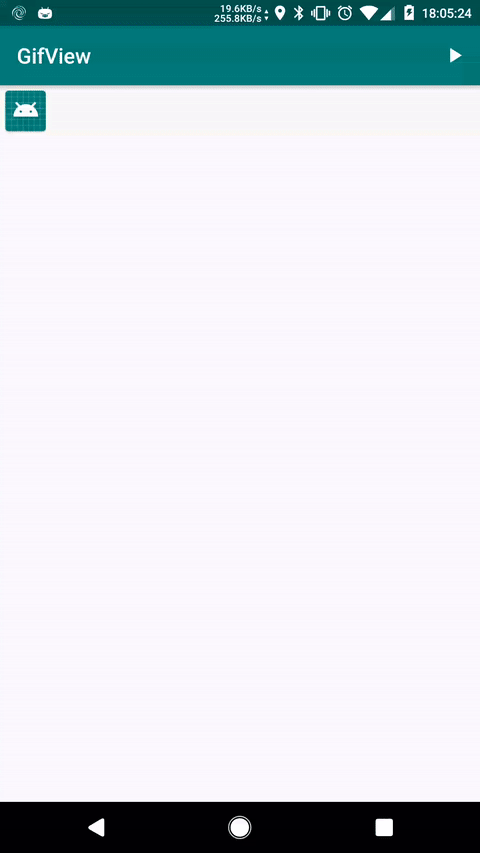

# GifView
a simple widget that can play gif.

## Example


## Usage
```java
// after set resource ,it will auto play by it self .
mGifView.setImageResource(
        "https://upload.wikimedia.org/wikipedia/commons/4/43/Animation-battery_Android_8.gif");
    mGifView.setTimes(5);
    mGifView.setPlaceHolder(R.mipmap.ic_launcher);
    mGifView.setOnGifSateListener(new GifView.OnGifStateListener() {
      @Override
      public void onStart(int executedTimes, GifView view) {
        showLog("onStart " + executedTimes);
      }

      @Override
      public void onStop(int executedTimes, GifView view) {
        showLog("onStop " + executedTimes);
      }

      @Override
      public void onMoving(int executedTimes, GifView view) {
        showLog("onMoving " + executedTimes);
      }
    });
    
    mGifView.start();
    mGifView.stop();
```

## Problems
- It can't promise that the number of plays is always right